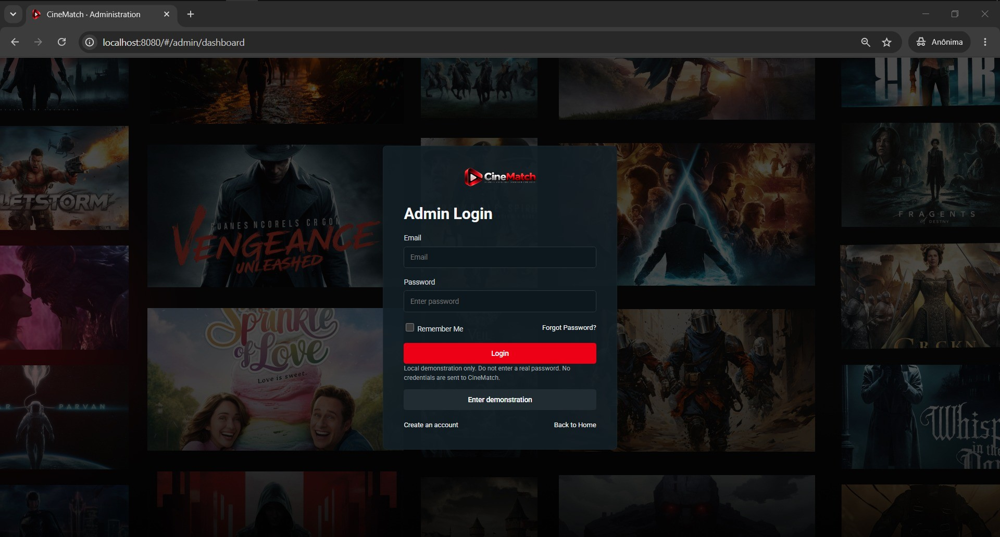
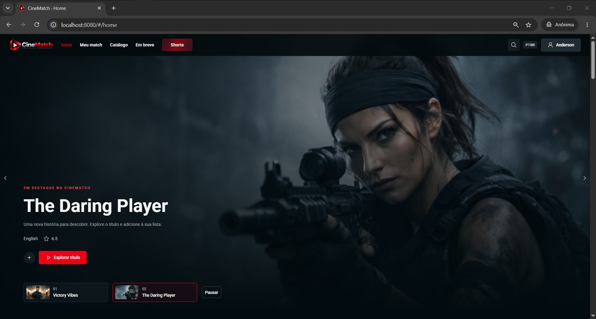
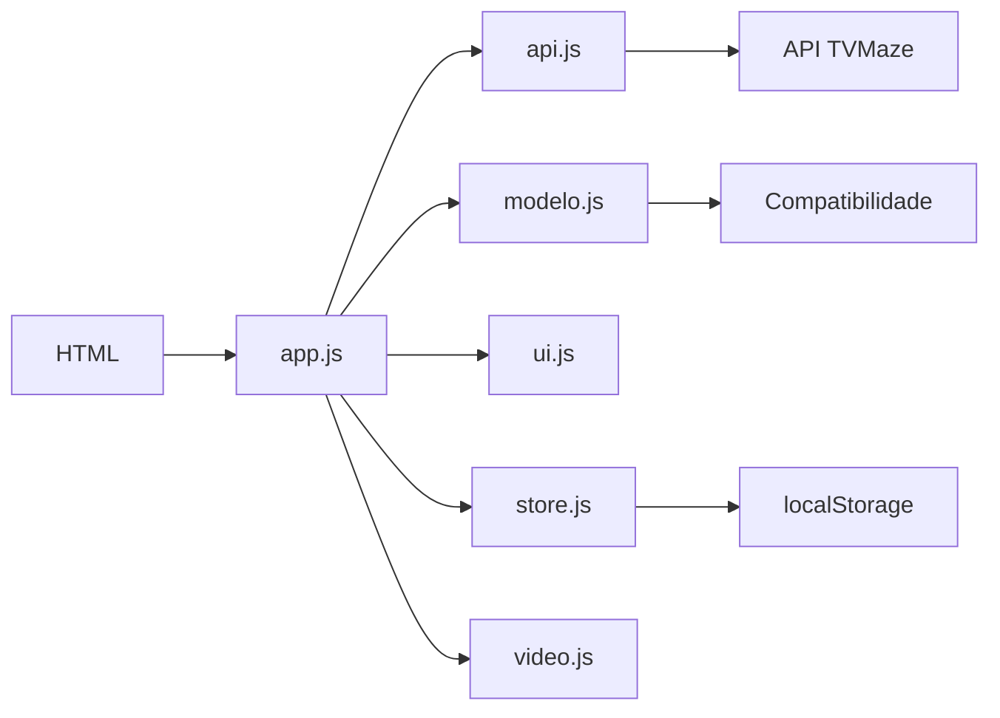
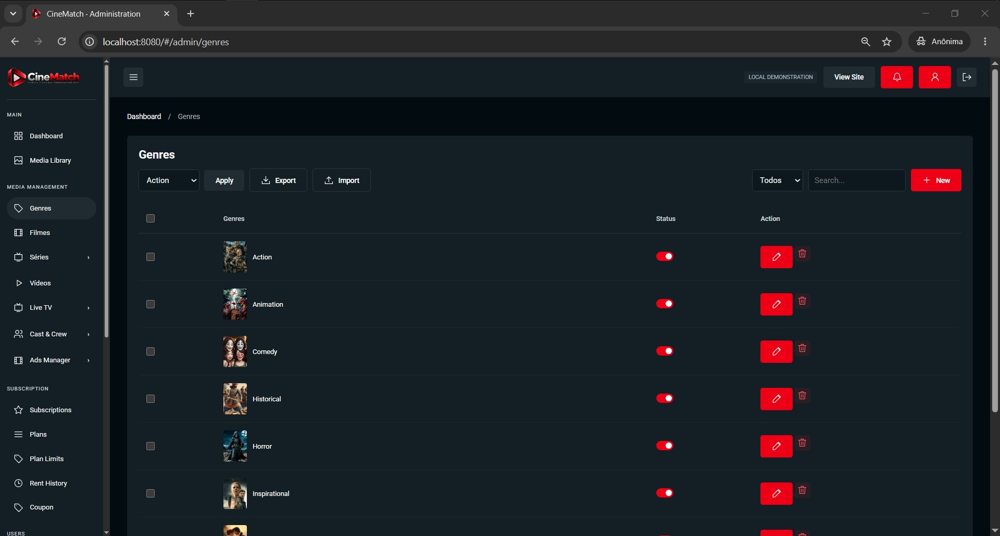

<div align="center">
  

  <h1>CineMatch</h1>
  <p><strong>Descubra séries que combinam com você.</strong></p>
  <p>Um projeto web de recomendação de séries por afinidade de gêneros, feito com HTML, CSS e JavaScript puro.</p>

  <p>
    
    
    
    
  </p>
</div>

---

## Sobre o projeto

O CineMatch ajuda a descobrir séries a partir dos gêneros favoritos de cada pessoa. Na primeira visita, o usuário cria um perfil simples. O site busca séries na API pública da TVMaze, calcula a compatibilidade entre os gêneros escolhidos e os gêneros de cada série e apresenta recomendações.

O projeto foi desenvolvido como aplicação de front end e material de estudo. Os dados do perfil e da lista ficam no navegador; não há servidor próprio nem conta autenticada.

## Telas do projeto

<div align="center">
  
  
</div>

<p align="center"><em>Login demonstrativo e criação de perfil.</em></p>

## Funcionalidades

- Perfil com nome, idade e seleção de gêneros favoritos.
- Preferências guardadas localmente no navegador com `localStorage`.
- Catálogo de séries obtido da API TVMaze.
- Recomendações ordenadas por compatibilidade e nota.
- Exibição dos gêneros em comum e dos gêneros que a pessoa ainda pode explorar.
- Estados de carregamento, catálogo vazio, erro e nova tentativa da consulta.
- Página inicial com banners rotativos, carrosséis e navegação para catálogo.
- Prévia dos títulos, lista de favoritos e botão para voltar ao topo.
- Player de trailers do YouTube quando existe um link e a incorporação está autorizada.
- Painel administrativo de demonstração com operações locais no navegador.
- Layout responsivo, navegação por teclado e respeito à preferência de movimento reduzido.

## Como funciona a compatibilidade

A porcentagem é calculada com base nos gêneros únicos de cada série:

```text
compatibilidade = (gêneros da série que também estão no perfil / total de gêneros da série) × 100
```

Por exemplo, se uma série tem quatro gêneros e dois deles estão entre os favoritos, sua compatibilidade é `50%`.

**Configuração ainda necessária:** o guia do projeto não informa os limites que definem compatibilidade “Alta”, “Média” e “Baixa”. Por isso, os limites `media` e `alta` estão como `null` em `js/config.js`, e a interface informa “Faixas pendentes”. A porcentagem continua sendo calculada. Para completar essa classificação, substitua esses valores pelos limites do código original do CineMatch.

## Tecnologias

| Tecnologia | Uso no projeto |
|---|---|
| HTML5 | Estrutura das páginas e elementos acessíveis. |
| CSS3 com Flexbox | Estilos, responsividade, carrosséis e animações. |
| JavaScript moderno | Interações, navegação, validação e renderização da interface. |
| ES Modules | Organização do JavaScript com `import` e `export`. |
| Fetch API | Consulta assíncrona ao catálogo da TVMaze. |
| `localStorage` | Armazenamento local do perfil, favoritos e dados de demonstração. |

Não é necessário React, TypeScript ou um processo de compilação para executar este pacote. O servidor local é usado porque módulos do navegador e integrações externas precisam ser servidos por HTTP.

## Executar localmente

É necessário ter Node.js e npm instalados.

```bash
# 1. Instale as dependências de desenvolvimento
npm install

# 2. Inicie o servidor local
npm start
```

Abra **http://localhost:8080** no navegador. Também é possível usar a extensão Live Server do VS Code. Não abra `index.html` diretamente com duplo clique: a aplicação usa módulos JavaScript.

Para executar os testes automatizados:

```bash
npm test
```

## Estrutura do projeto

```text
cinematch/
├── assets/
│   ├── favicon.svg
│   └── readme/               # Logo e capturas usadas neste README
├── css/
│   └── style.css             # Estilos e layouts Flexbox
├── docs/
│   ├── MAPEAMENTO.md
│   ├── REQUISITOS.md
│   └── TESTES.md
├── js/
│   ├── app.js                # Inicialização, rotas, eventos e páginas
│   ├── api.js                # Consulta e normalização dos dados TVMaze
│   ├── config.js             # API, temporização e limites de compatibilidade
│   ├── data.js               # Dados demonstrativos e conteúdo de referência
│   ├── modelo.js             # Classes e cálculo de afinidade
│   ├── store.js              # Persistência e operações locais
│   ├── ui.js                 # Validação e criação de elementos da interface
│   └── video.js              # Tratamento dos players
├── tests/
│   └── core.test.js
├── index.html
├── package.json
└── README.md
```

## Organização da aplicação



## Navegação principal

A aplicação também pode ser acessada pelos atalhos abaixo depois que o site estiver rodando:

| Área | Caminho |
|---|---|
| Início | `index.html#/home` |
| Meu match | `index.html#/recomendacoes` |
| Filmes | `index.html#/movies` |
| Séries TVMaze | `index.html#/tv-shows` |
| Minha lista | `index.html#/watchlist` |
| Painel | `admin.html#/admin/dashboard` |

## Painel de demonstração


O painel administrativo é uma interface local para demonstrar navegação e operações de cadastro. Os dados ficam neste navegador. Ele **não** está conectado ao painel Laravel de referência, a um banco de dados, nem a um sistema de autenticação real. Use o botão de entrada de demonstração na tela de login administrativo.

## API e atribuição

O catálogo usa a [API da TVMaze](https://www.tvmaze.com/api). A consulta depende de conexão com a internet e da disponibilidade do serviço. Os dados são atribuídos à TVMaze e estão sujeitos à licença indicada pelo serviço, incluindo CC BY-SA.

Pôsteres, banners e trailers são carregados de serviços externos quando disponíveis. A reprodução de trailers depende das permissões de incorporação definidas por quem publicou cada vídeo. Este projeto não disponibiliza filmes completos.

## Limitações conhecidas

- Perfil, favoritos e painel são locais ao navegador e não sincronizam entre dispositivos.
- Login, cadastro e redefinição de senha são telas de demonstração; não criam contas reais.
- Os limites das classificações Alta/Média/Baixa aguardam os valores do código original.
- Disponibilidade de imagens e trailers depende de serviços externos.
- O projeto não reproduz nem inclui o backend, a autenticação ou os serviços privados do Streamit Laravel.
- Verifique os direitos de uso dos materiais visuais externos antes de publicar ou distribuir uma versão pública.

## Materiais adicionais

- [Requisitos e relação com o guia acadêmico](docs/REQUISITOS.md)
- [Escopo dos testes e verificações](docs/TESTES.md)
- [Mapa de navegação](docs/MAPEAMENTO.md)

---

<div align="center">
  <sub>CineMatch · Projeto acadêmico de recomendação de séries</sub>
</div>
