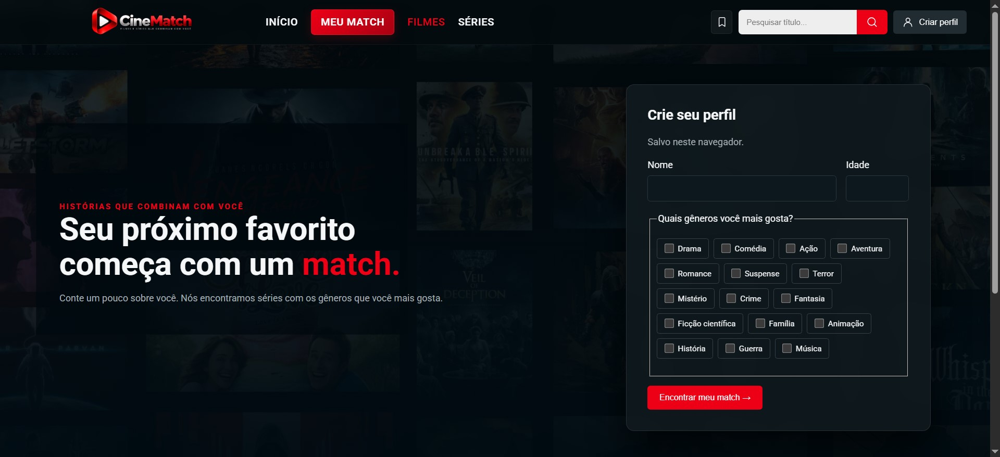
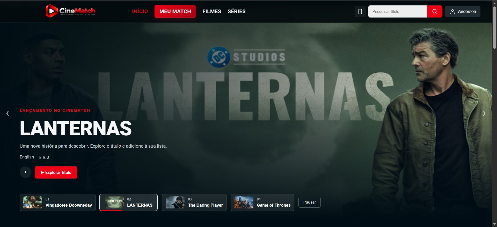
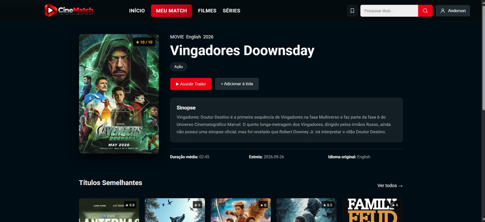
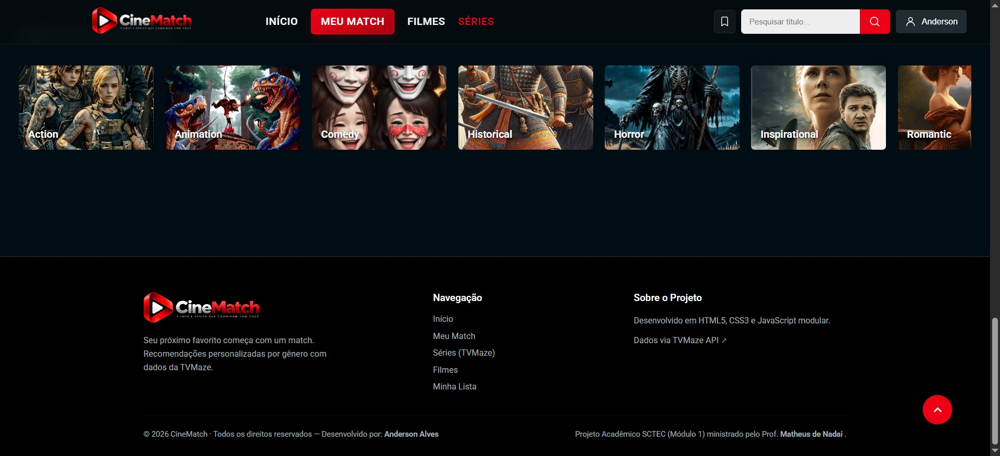
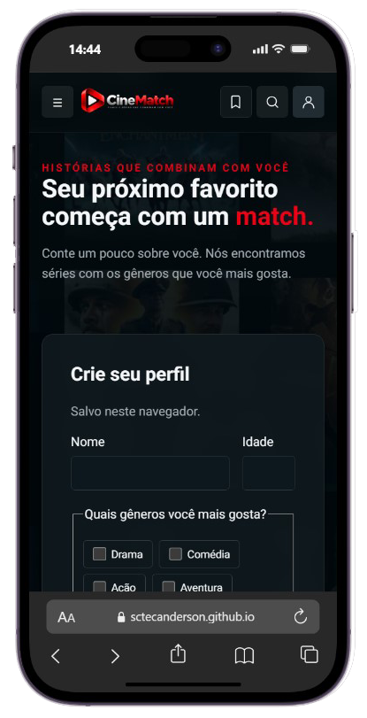
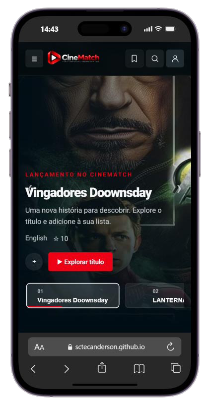
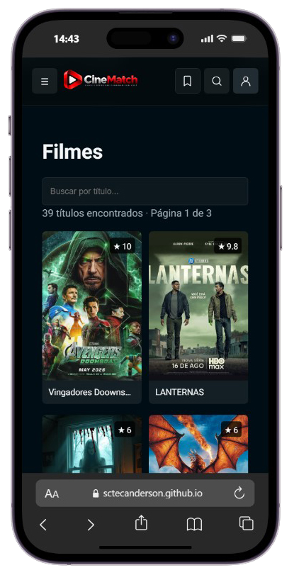
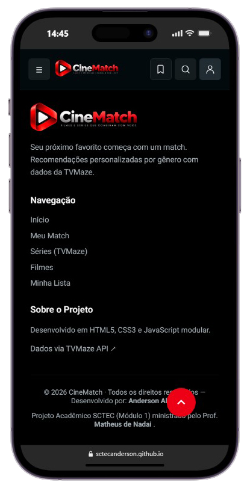

<div align="center">
  

  <h1>CineMatch Web</h1>
  <p><strong>Recomendação de Séries em Tempo Real com TVMaze API</strong></p>
  <p>Projeto Avaliativo Final do Módulo 01 — Formação Mobile React Native (SCTEC / SESI SENAI)<br>
  Ministrado pelo <strong>Prof. Matheus de Nadai</strong></p>

  <p>
    
    
    
    
    
  </p>
</div>

---

## 📌 Links de Entrega (AVA)

* 🔗 **Repositório GitHub:**  [Acesse o CINEMATCH no seu Navegador](https://sctecanderson.github.io/CineMatch/)
* 📋 **Quadro Kanban (Trello):** [Acesse o Quadro do Projeto](https://trello.com/b/xFGqs6B4/cinematch-projeto-web) 
* 🎥 **Vídeo de Apresentação (Até 7 min):** [Assista à Demonstração no YouTube / Google Drive](https://...) 

---

## 🎯 Sobre o Projeto

O **CineMatch Web** é a evolução prática do motor de recomendação desenvolvido inicialmente via terminal no início do módulo. A aplicação foi concebida para resolver o problema da sobrecarga de escolhas em plataformas de streaming, conectando a pessoa usuária a conteúdos que realmente combinam com seus gostos pessoais.

A aplicação web coleta o perfil da pessoa usuária (nome, idade e gêneros favoritos) através de um formulário interativo, persiste essas preferências no navegador via `localStorage` e consulta o catálogo em tempo real da **TVMaze API**. A partir desses dados, a aplicação calcula o índice de compatibilidade, trata os dados com métodos modernos de array e Programação Orientada a Objetos (POO), e renderiza uma interface cinematográfica, fluida e responsiva.

---
<div align="center">
<h2> 📸 Telas do Projeto</h2>
 </div>
<table align="center">
  <tr>
    <td></td>
    <td></td>
    <td></td>
    <td></td>
  </tr>
  <tr>
    <td></td>
    <td></td>
    <td></td>
    <td></td>
  </tr>
</table>

<p align="center"><em>Versões para desktop e celular do CineMatch.</em></p>
---

## ✨ Funcionalidades Principais

* **Perfil Personalizado (RF02 e RF03):** Coleta nome, idade e preferências por checkboxes, persistindo no navegador via `localStorage` com tratamento de visitas recorrentes e opção de troca de perfil.
* **Consumo em Tempo Real da TVMaze API (RF04):** Requisição assíncrona com `fetch` e `async/await`, estruturada dentro de `try/catch` com tratamento dos 3 estados: **carregando**, **vazio** e **erro**.
* **Tratamento de Dados com Métodos de Array (RF05):** Filtragem, ordenação e mapeamento utilizando amplamente `filter()`, `map()`, `sort()`, `slice()` e `some()`.
* **Motor de Afinidade em POO (RF06 e RF07):** Classes `Conteudo` e `Serie` com herança e uso de `this`, calculando a porcentagem exata de afinidade e separando gêneros em comum de gêneros não explorados.
* **Classificação por Faixas de Afinidade:** Classificação automática em **Alta** (≥ 80%), **Média** (≥ 50%) e **Baixa** (< 50%) com badges visuais.
* **Controle por Closures e Callbacks (RF10 e RF11):** Função closure mantendo o contador de recálculos/consultas na sessão exibido na interface, e callback disparado ao concluir a busca de dados.
* **Navegação SPA Fluida e Histórico:** Roteamento baseado em hash (`#/home`, `#/recomendacoes`, `#/movies`, `#/tv-shows`, `#/watchlist`, `#/detail/:id`).
* **Interatividade & Multimídia (RF12):** Hero banner com rotação automática via `setInterval`, controle de pausa/retomada, modal nativo (`<dialog>`) com player de trailer, paginação dinâmica e busca instantânea com botão limpar.
* **Acessibilidade e SEO (RF01 e RF13):** Landmarks semânticos (`<header>`, `<main>`, `<section>`, `<article>`, `<footer>`), link skip para navegação por teclado, rótulos associados aos campos (`label for`), contraste adequado e meta tags Open Graph.

---

## 🧮 Como Funciona o Cálculo de Afinidade (RF07)

A porcentagem de match entre o perfil da pessoa usuária e cada série do catálogo segue a fórmula:

$$\text{Compatibilidade (\%)} = \left( \frac{\text{Gêneros da Série em Comum com o Perfil}}{\text{Total de Gêneros da Série}} \right) \times 100$$

### Faixas de Classificação (`js/config.js`):
* 🟢 **Alta Afinidade:** Compatibilidade $\ge 80\%$
* 🟡 **Média Afinidade:** Compatibilidade $\ge 50\%$ e $< 80\%$
* 🔴 **Baixa Afinidade:** Compatibilidade $< 50\%$

Além do percentual, o motor analisa e renderiza no card quais foram os **gêneros em comum** e quais são os **gêneros não explorados** pela pessoa usuária.

---

## 📚 Fundamentação Técnica e Conceitos do Módulo (RF14 e Critérios de Avaliação)

### 1. Diferença entre CommonJS e ES Modules (ESM) — RF14
* **CommonJS (`require` / `module.exports`):** Foi o padrão adotado na primeira versão de terminal do CineMatch. Funciona de maneira síncrona e em tempo de execução no Node.js, sendo inadequado para o ecossistema moderno do navegador sem a intervenção de ferramentas de build complexas.
* **ES Modules (`import` / `export`):** Padrão oficial introduzido a partir do ES6. Opera de forma estática e assíncrona, permitindo carregamento sob demanda através do navegador com `<script type="module">`. No CineMatch Web, o ESM permitiu modularizar a aplicação com responsabilidades estritas (`api.js`, `modelo.js`, `store.js`, `ui.js`, `video.js`, `config.js` e `app.js`), promovendo alto desacoplamento e manutenibilidade sem dependência de bundlers externos.

### 2. Escopo e Escolha de Declaração de Variáveis (`const` e `let` vs `var`)
Neste projeto foi adotado o padrão moderno de escopo de bloco, com **abolição total do `var`**:
* **`const`:** Utilizado como primeira escolha para todas as declarações cujas referências não devem mudar: seletores do DOM, imports de módulos, instâncias de classes, arrays imutáveis e configurações globais. Previne mutações de referência e reatribuições acidentais.
* **`let`:** Utilizado estritamente onde o estado da aplicação necessita de reatribuição ao longo do ciclo de vida: controle de paginação (`paginaCatalogo`, `paginaMatch`), índice do banner rotativo (`heroIndex`), estado da requisição e dados de busca.
* **Vantagem direta:** Eliminação do risco de vazamento de escopo por içamento (*hoisting*) do `var`, garantindo que variáveis existam somente dentro do bloco (`{ ... }`) onde foram criadas.

---

## 🛠️ Tecnologias Utilizadas

| Tecnologia | Finalidade no Projeto |
|---|---|
| **HTML5 Semântico** | Marcação estrutural com landmarks, atributos ARIA, SEO on-page e Open Graph. |
| **CSS3 & Flexbox** | Estilização mobile-first, grid de cards responsivo, animações e media queries centralizadas. |
| **JavaScript ES6+** | Lógica de programação funcional, POO (classes e herança), closures e callbacks. |
| **Fetch API & Promises** | Consumo assíncrono do catálogo de shows da TVMaze API com tratamento de erros. |
| **Web Storage (`localStorage`)** | Persistência local do perfil do usuário e da lista de favoritos com serialização JSON. |
| **Node.js & npm** | Gerenciamento do pacote de desenvolvimento para execução local com servidor HTTP. |

---

## 📁 Estrutura de Arquivos

```text
cinematch-web/
├── assets/                   # Pôsteres, banners, ícones e logotipo
├── css/
│   └── style.css             # Folha de estilos unificada (Flexbox + Media Queries)
├── js/
│   ├── api.js                # Requisição HTTP e normalização da TVMaze API
│   ├── app.js                # Ponto de entrada (controlador, rotas, eventos e DOM)
│   ├── config.js             # Constantes, URLs de endpoints e limites de afinidade
│   ├── data.js               # Catálogo base estático, canais e coleções
│   ├── modelo.js             # Classes Conteudo e Serie, herança e closures
│   ├── store.js              # Camada de persistência local e gestão do catálogo
│   ├── ui.js                 # Fábrica de componentes visuais e validação de perfil
│   └── video.js              # Utilitário de montagem do player de trailer
├── index.html                # Ponto de entrada da aplicação web
├── package.json              # Metadados do projeto e scripts npm
├── .gitignore                # Arquivos ignorados pelo Git (node_modules, etc.)
└── README.md                 # Documentação completa do projeto
```

> 📖 Para instruções detalhadas, consulte o [guia de instalação](./README_INSTALACAO.md).
